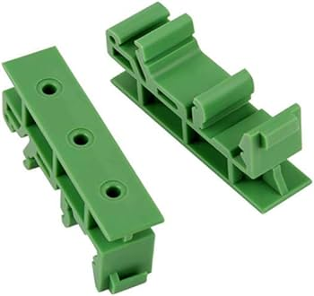
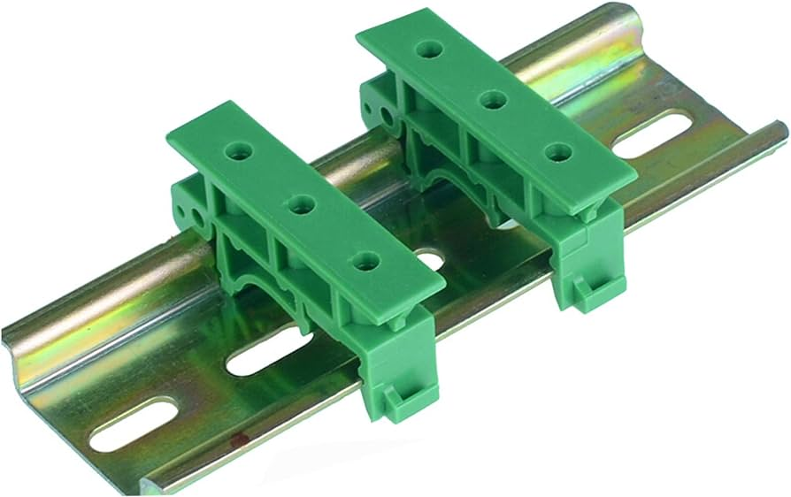

## Top
# 🎉 DAWG AC Relay Driver Board v1.0.0
### ◀️ [Back](/)


<!--📷-->

## Table of Contents

- 📚 [Overview](#overview)
- 🎯 [Features](#features)
- 🛠️ [Usage](#usage)
- ⚙️ [Installation](#installation)
- 🖥️ [Compatible Processor Boards](#compatible-processor-boards)
- 🤝 [FAQ](#faq)
- 🤝 [Contributing](#contributing)
- 📝 [License](#license)


## Overview

DAWG (AC Relay Driver Board). This board is purpose-built to address a common need in electronics projects: providing a reliable AC relay driver. Its primary goal is to enable low-voltage output controllers like Arduino and ESP microcontrollers to efficiently control multiple AC CONTACTORS or Industrial DC Relay Switches (of DC voltage more than 12VDC).

## Features

- **Relay Control:** This feature simplifies the process of controlling mechanical and solid-state relays, enabling you to manage higher voltage loads with ease.

- **Versatility:** The board is designed to drive HV relay switches, encompassing both mechanical and solid-state options, making it adaptable to a wide range of applications.

- **Ease of Integration:** The board ensures easy integration through user-friendly terminal screw blocks, connectors, and pin headers configurations.

- **DIN Rail Support:** DIN RAIL compatibility enables seamless mounting in standard 35mm DIN RAIL enclosures. This feature ensures that your projects have a professional and sturdy appearance and can be effortlessly integrated into existing distribution panels.

- **Comprehensive Documentation:** Access comprehensive documentation to swiftly get started and leverage the full potential of your relay driver.


[🔝 Top](#top)

## Usage

NA

[🔝 Top](#top)

## Installation

If you want to install it on a rail din enclosure, you will need:

- A mounting bracket with two 3mm M3 screws at 25mm center to center apart.


- Slotted Steel RAIL DIN.


- Actual Setup.


  
[🔝 Top](#top)

## Compatible Processor Boards

MARVIN PCB Board v1.0.0 is compatible with a range of processor boards, including:

| Board              | Link                                       | Image                                                                                                 | Description                                                                                                                                      | GPIO Output Pins     |
|--------------------|--------------------------------------------|-------------------------------------------------------------------------------------------------------|--------------------------------------------------------------------------------------------------------------------------------------------------|---------------|
| **Foghorn v1.0.0** | [FOGHORN](https://github.com/seryalda/foghorn) |  | The board integrates with the Foghorn Version 1.0.0 Processor Board. It's an ESP8266 NodeMCU v3 compatible board with a screw terminal block output mapped to GPIO pins 4, 5, 12, and 14, allowing control of up to 4 external switch relays or CONTACTORS. | 4, 5, 12, 14 |


Explore the compatibility of DAWG with these processor boards to enhance your projects.

[🔝 Top](#top)

## FAQ

N/A

[🔝 Top](#top)

## Contributing

| Board | Mounting Brackets | Slotted Metal Rail DIN  | Screws M3 D=3mm, L=6mm   | Panel Box     |
|--------------------|--------------------------------------------|-------------------------------------------------------------------------------------------------------|--------------------------------------------------------------------------------------------------------------------------------------------------|---------------|
|  |  |  |  |  |

[🔝 Top](#top)

## License

Certainly! Here's an example of a table with fixed image width and wrapped titles:

```markdown
| Board | Mounting Brackets | Slotted Metal Rail DIN | Screws M3 D=3mm, L=6mm | Panel Box |
|-------|-------------------|------------------------|-------------------------|-----------|
|  |  |  |  |  |
```

Please note that GitHub's markdown doesn't directly support specifying image dimensions using HTML-like attributes, so these dimensions might not directly work. GitHub supports HTML tags to a certain extent, but it might not render as expected. Adjustments might be needed based on the markdown rendering of the platform you're using.


[🔝 Top](#top)

---
