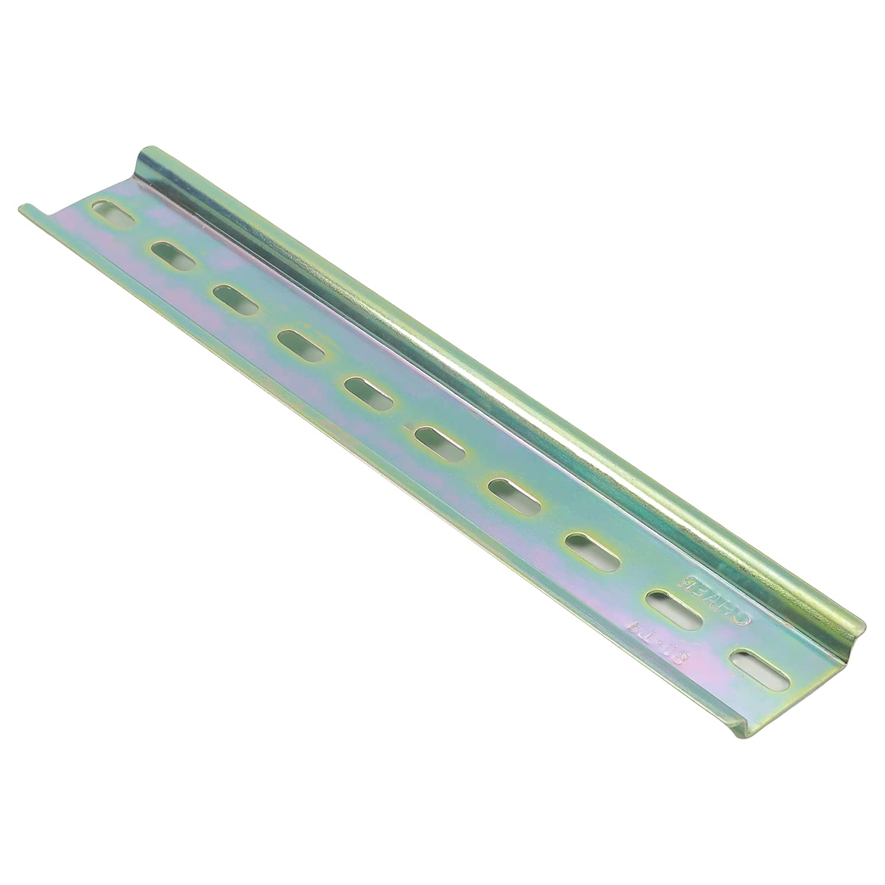

## Top
# 🎉 DAWG 4-Channel AC Relay Driver Board for Microcontrollers v1.0.0
### ◀️ [Back](/)

[🛍️ BUY THIS BOARD!](https://www.amazon.sa/dp/B0CN12CGTB/)
<!--📷-->

## Table of Contents

- 🌐 [Overview](#overview)
- ⭐ [Features](#features)
- 🤔 [Things you need to know](#things-you-need-to-know)
- ⚙️ [Installation](#installation)
- 🖥️ [Compatible Processor Boards](#compatible-processor-boards)
- ❓ [FAQ](#faq)
- 📜 [Disclaimer](#disclaimer)
- 📝 [Demo](#demo)

## Overview

The DAWG AC Relay Driver Board is a purpose-built, specialized solution for electronics projects. Measuring 76mm x 86mm, this RAIL DIN board with two screw holes (25mm center to center apart) offers a reliable means to control AC CONTACTORS or Industrial DC Relay Switches with DC voltage exceeding 12VDC. Unlike standard relays, this 4-channel relay driver serves as an intermediary, allowing low-voltage output controllers like Arduino and ESP microcontrollers to effectively activate external DC relay switches using user-selected AC voltages.

Powered by an external 5VDC source, the board simplifies the control of multiple relay switches for diverse applications, making it an ideal choice for various electronic projects.

### Features
- 4-channel relay driver board for AC CONTACTORS and Industrial DC Relay Switches.
- Designed to work with low-voltage output controllers like Arduino and ESP microcontrollers.
- Enables control of external DC relay switches using user-selected AC voltages.
- Dimensions: 76mm x 86mm RAIL DIN board with two screw holes.
- External 5VDC power source for operation.
- Ideal for applications requiring reliable and efficient relay driving.

[🔝 Top](#top)

## Things you need to know

### DAWG - 4-Channel AC Relay Driver Board for Arduino and ESP Microcontrollers
- **Power Requirements:** Ensure a stable external 5VDC power source for optimal operation.
- **Voltage Limitations:** Verify the DC voltage does not exceed 12VDC for controlling AC CONTACTORS or Industrial DC Relay Switches.
- **Compatible Controllers:** Intended for use with low-voltage output controllers such as Arduino and ESP microcontrollers.
- **Size Consideration:** Dimensions are 76mm x 86mm, so ensure adequate space for installation.
- **Relay Switches:** Use appropriate relay switches compatible with the board for desired functionality.

[🔝 Top](#top)

## Installation

Things and diagram you will need, for wiring and to implement RAIL DIN configurations:

| How to Wire Diagram | Sample Wiring | Slotted Metal Rail DIN  | Screws M3 D=3mm, L=6mm   | Mounting Brackets (25mm center to center) |
|--------------------|--------------------------------------------|-------------------------------------------------------------------------------------------------------|--------------------------------------------------------------------------------------------------------------------------------------------------|---------------|
|  |  |  |  |  |
|||[🛍️ BUYHERE](#)|[🛍️ BUYHERE](#)|[🛍️ BUYHERE](GOOGLE.COM)|

  
[🔝 Top](#top)

## Compatible Processor Boards

DAWG Board v1.0.0 also works with below Processor Board:

| Board              | Link                                       | Image                                                                                                 | Description                                                                                                                                      | GPIO Output Pins     |
|--------------------|--------------------------------------------|-------------------------------------------------------------------------------------------------------|--------------------------------------------------------------------------------------------------------------------------------------------------|---------------|
| **Foghorn v1.0.0** | [FOGHORN](https://github.com/seryalda/foghorn) |  | The board integrates with the Foghorn Version 1.0.0 Processor Board. It's an ESP8266 NodeMCU v3 compatible board with a screw terminal block output mapped to GPIO pins 4, 5, 12, and 14, allowing control of up to 4 external switch relays or CONTACTORS. | 4, 5, 12, 14 |

Explore the compatibility of DAWG with these processor boards to enhance your projects.

[🔝 Top](#top)

## FAQ

N/A

[🔝 Top](#top)

## Disclaimer

Use this module at your own risk. There is no warranty that this design is safe for your application. The user assumes all responsibility for any consequences resulting from the use of this module.

[🔝 Top](#top)

## Demo

[🔝 Top](#top)

